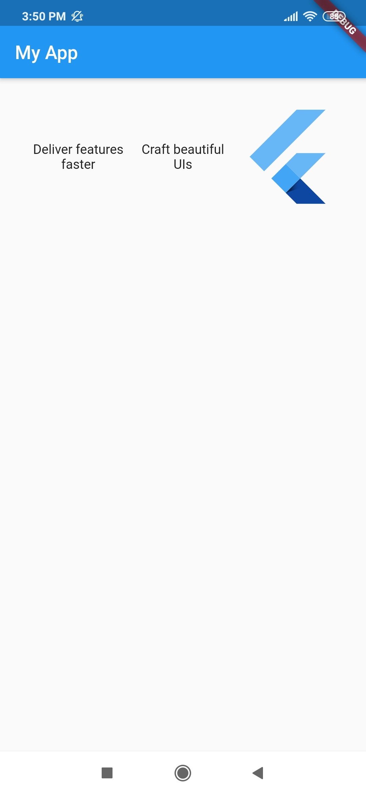
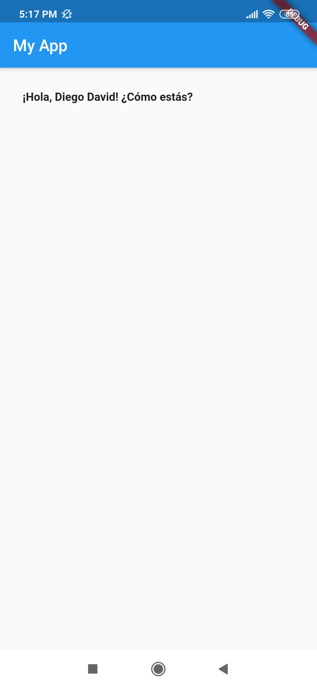
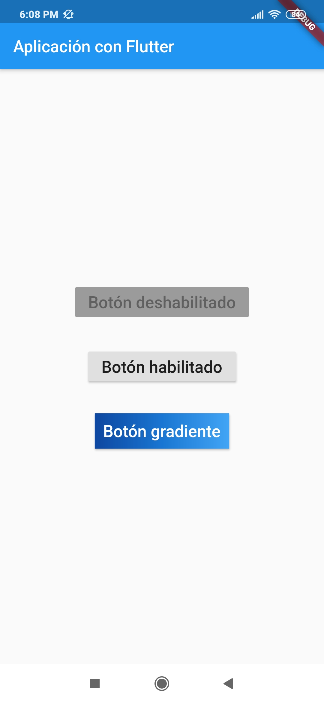
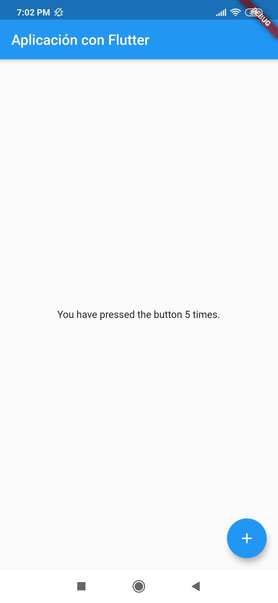

# Flutter

## Instalar Chocolate

1. Vamos al sitio oficial de [chocolate]()

2. Copiamos el comando de instalación para powershell V3+

3. Abrimos el powershell como administrador, pegamos el comando y damos enter.

```shell
Set-ExecutionPolicy Bypass -Scope Process -Force; [System.Net.ServicePointManager]::SecurityProtocol = [System.Net.ServicePointManager]::SecurityProtocol -bor 3072; iwr https://chocolatey.org/install.ps1 -UseBasicParsing | iex
```

## Actualizar dart

Vamos al sitio oficial de [dart]() copiamos el enlace de upgrade y pegamos en el powershell.

```shell
choco upgrade dart-sdk
```


## Conectar un dispositivo vía Wi-fi

**adb** usualmente se comunica con los dispositivos vía USB, pero tú puedes también usar adb vía Wi-fi después de una configuración inicial a través de USB.

adb está incluido en el paquete Android SDK Platform-Tools. Puede descargar este paquete con el SDK Manager, que lo instala en android_sdk/platform-tools/. O si desea el paquete independiente de herramientas de plataforma SDK de Android, puede [descargarlo aquí](https://developer.android.com/studio/releases/platform-tools).

1. Si tienes instalado el Sdk de Android en Windows el path estará en esta dirección `C:\Users\usuario\AppData\Local\Android\sdk\platform-tools` si no lo tenías y lo descargaste, descomprime en algún lugar y actualiza el path en `variables de entorno`

<p style="text-align: center;">
	
</p>


2. Conecte su dispositivo Android y su computadora host adb a una red Wi-Fi común accesible para ambos.

3. Si se está conectando a un dispositivo Wear OS, apague Bluetooth en el teléfono que está emparejado con el dispositivo.

4. Abre las configuraciones de tu teléfono > Wi-Fi > Ajustes adicionales, anota tu dirección IP a la que estás conectado, ejemplo: 192.168.0.100

5. Conecte el dispositivo a la computadora host con un cable USB.

6. Configure el dispositivo de destino para escuchar una conexión TCP/IP en el puerto 5555.

```powershell
adb tcpip 5555
adb connect <device ip addr>:5555
adb devices
```

<p style="text-align: center;">
	
</p>

Ahora, está listo para usarse con tus aplicaciones desarrolladas en Android a través de Wi-Fi.

Si alguna vez se pierde la conexión adb:

1. Asegúrese de que su host todavía esté conectado a la misma red Wi-Fi que su dispositivo Android.
2. Vuelva a conectarse ejecutando el adb connect paso nuevamente.
3. O si eso no funciona, restablezca su host adb:

```powershell
adb kill-server
```

Luego comienza de nuevo desde el principio.


## Widgets

Crear apps con la colección de widgets visuales, estructurales, de plataforma, e interactivos de Flutter.

### Uso de widgets básicos

Estos son algunos de los Widgets imprescindibles que debes conocer antes de construir tu primera app Flutter.

#### Container

* Un contenedor primero rodea al child con `padding` y luego aplica `constraints` adicionales.
* Los contenedores sin hijos intentará ser lo más grandes posible a menos que las restricciones entrantes sean ilimitadas, en cuyo caso intentan ser lo más pequeñas posible. Los contenedores con hijos se adaptan a sus hijos.

* El widget `Container` le ayuda a componer, decorar y colocar widgets secudarios.

Puedes usar propiedades para sus hijos como:

```dart
	padding: EdgeInsets.all(28.0),
    alignment: Alignment.center,
```

Puedes aplicar transformaciones:

```dart
	transform: Matrix4.rotationZ(0.05),
```

Por ejemplo con el siguite código:

```dart
import 'package:flutter/material.dart';

void main() {
  runApp(MaterialApp(
    home: MyApp(),
  ));
}

class MyApp extends StatefulWidget{
  @override
  _State createState() => _State();
}

class _State extends State<MyApp>{
  @override
  Widget build(BuildContext context) {
    // TODO: implement build
    return Scaffold(
      appBar: AppBar(
        title: Text('My App'),
      ),
      body: Container(
        padding: EdgeInsets.all(28.0),
        transform: Matrix4.rotationZ(0.1),
        child: Center(
          child: Column(
            mainAxisAlignment: MainAxisAlignment.center,
            children: <Widget>[
              Text('Aplicación de ejemplo Diego David')
            ],
          )
        )
      )
    );
  }
}	
```

Tenemos el siguite resultado:

<p style="text-align: center;">
	
</p>


### Row 

Es un widget que desplega a sus hijos en un arreglo horizontal.
 
Para hacer que un hijo ocupe todo el espacio horizontal disponible, debe agregar dentro de un Widget `Expanded`

Es importante saber que el widget Row **no se desplaza** (y en general se considera un **error** tener más hijos en una fila de los que caben en la sala disponible).

Para esto considere usar `ListView` si desea que puedan desplazarse si no hay suficiente espacio.


```dart
body: Container(
    padding: EdgeInsets.all(28.0),
    child: Row(
      children: <Widget>[
        Expanded(
            child: Text('Desarrollo de aplicaciones', textAlign: TextAlign.center),
        ),
        Expanded(
          child: Text('Diego David', textAlign: TextAlign.center),
        ),
        Expanded(
          child: FittedBox(
            fit: BoxFit.contain, // otherwise the logo will be tiny
            child: const FlutterLogo(),
          ),
        ),
      ],
    ),
  )
```

<p style="text-align: center;">
	
</p>

#### Posibles problemas

Puede aparece una franja de advertencia amarilla y negra. Esto se debe cuando los contenidos no flexibles de la fila (aquellos que no están envueltos en widgets `Expanded` o `Flexible`) son juntos más anchos que la fila en sí, entonces se dice que la fila se ha desbordado. Cuando una fila se desborda, la fila no tiene espacio restante para compartir entre sus elementos secundarios expandidos y flexibles. La fila informa esto dibujando un cuadro de advertencia de rayas amarillas y negras en el borde que se desborda. Si hay espacio en el exterior de la fila, la cantidad de desbordamiento se imprime en letras rojas.

Por ejemplo si tú tienes:

```dart
body: Container(
        padding: EdgeInsets.all(28.0),
        child: Row(
          children: <Widget>[
            const FlutterLogo(),
            const Text("Desarrollando aplicaciones móviles en Flutter con Diego David, este es un ejemplo de desbordamiento, se mostrará un error"),
            const Icon(Icons.sentiment_very_satisfied),
          ],
        )
      )	
```

Observarás algo similar a:

<p style="text-align: center;">
	
</p>

Para solucionar esto envolvemos al segundo hijo en un widget `Expanded` 

```dart
body: Container(
        padding: EdgeInsets.all(28.0),
        child: Row(
          children: <Widget>[
            const FlutterLogo(),
            const Expanded(
              child: Text("Desarrollando aplicaciones móviles en Flutter con Diego David, este es un ejemplo de desbordamiento, NO se mostrará un error"),
            ),
            const Icon(Icons.sentiment_very_satisfied),
          ],
        )
      )	
```

<p style="text-align: center;">
	
</p>


### Column 

Un widget que desplega sus hijos en un arreglo vertical.

Para hacer que un hijo ocupe todo el espacio vertical disponible, debe agregar dentro de un Widget `Expanded`

Igual que el widget Row, Column **no se desplaza** (y en general se considera un **error** tener más hijos en una columna de los que caben en la sala disponible).

Si tú tienes un hijo, considera usar `Align` o `Center` para posicionar al hijo.

El siguiente ejemplo consta de tres hijos.


```dart
body: Container(
        padding: EdgeInsets.all(28.0),
        child: Column(
          children: <Widget>[
            Text('Desarrollo de aplicaciones'),
            Text('con Flutter'),
            Expanded(
              child: FittedBox(
                fit: BoxFit.contain, // otherwise the logo will be tiny
                child: const FlutterLogo(),
              ),
            ),
          ],
        )
      )	
```

<p style="text-align: center;">
	
</p>


Con `crossAxisAlignment` alineamos los elementos secundarios, por ejemplo con `crossAxisAlignment.start` estarán alineados a la izquierda. Con  `mainAxisSize.min` la columna se contrae para adaptarse a los hijos.

```dart
body: Container(
        padding: EdgeInsets.all(28.0),
        child: Column(
          crossAxisAlignment: CrossAxisAlignment.start,
          mainAxisSize: MainAxisSize.min,
          children: <Widget>[
            Text('Desarrollo de aplicaciones móviles'),
            Text('con Flutter'),
            Text('Diego David'),
          ],
        )
      )	
```

<p style="text-align: center;">
	
</p>


### Image

Existen varios cnstructores para especificar una imagen:

* `new Image`, para obtener una imagen de un `ImageProvider`.
* `new Image.asset`, para obtener una imagen de un `AssetBundle` usando una clave.
* `new Image.network`, para obtener una imagen de una URL.
* `new Image.file`, para obtener una imagen de un `File`.
* `new Image.memory`, para obtener una imagen de un `Uint8List`.

Admite los siguientes formatos: JPEG, PNG, GIF, GIF animado, WebP, WebP animado, BMP y WBMP.

La imagen se pinta con `paintImage`.

El constructor predeterminado se puede usar con cualquier proveedor de imágenes. Por ejemplo, para obtener una imagen de internet:


```dart
const Image(
  image: NetworkImage('https://flutter.github.io/assets-for-api-docs/assets/widgets/owl.jpg'),
)	
```

También se puede colocar una imagen de internet con `Image.network`


```dart
body: Container(
        padding: EdgeInsets.all(28.0),
        child: Column(
          crossAxisAlignment: CrossAxisAlignment.start,
          mainAxisSize: MainAxisSize.min,
          children: <Widget>[
            const Image(
              image: NetworkImage('https://flutter.github.io/assets-for-api-docs/assets/widgets/owl.jpg')
            ),
            SizedBox(height: 10),
            Expanded(
                child: Image.network('https://flutter.github.io/assets-for-api-docs/assets/widgets/owl-2.jpg'),
            )
          ],
        )
      )	
```

<p style="text-align: center;">
	
</p>


### Text

El widget `Text` despliega un `string` de texto con un simple estilo. El argumento de estilo es opcional.


```dart
body: Container(
        padding: EdgeInsets.all(28.0),
        child: Column(
          crossAxisAlignment: CrossAxisAlignment.start,
          mainAxisSize: MainAxisSize.min,
          children: <Widget>[
            Text(
              '¡Hola, $_name! ¿Cómo estás?',
              textAlign: TextAlign.center,
              overflow: TextOverflow.ellipsis,
              style: TextStyle(fontWeight: FontWeight.bold),
            )
          ],
        )
      )	
```

<p style="text-align: center;">
	
</p>

Usando el constructor `Text.rich` el widget `Text` puede mostrar un párrafo con `TextSpan` de estilo diferente.


```dart
 const Text.rich(
              TextSpan(
                text: 'Hola,', // default text style
                children: <TextSpan>[
                  TextSpan(text: ' Diego', style: TextStyle(fontStyle: FontStyle.italic)),
                  TextSpan(text: ' David', style: TextStyle(fontWeight: FontWeight.bold)),
                ],
              ),
            )	
```

<p style="text-align: center;">
	
</p>

### Icon

Debe haber un widget de direccionalidad ambiental cuando se usa `Icon`.

```dart
	body: Container(
        padding: EdgeInsets.all(28.0),
        child: Column(
          mainAxisAlignment: MainAxisAlignment.spaceAround,
          children: <Widget>[
            Icon(
              Icons.android,
              color: Colors.green,
              size: 24.0,
              semanticLabel: 'Text to announce in accessibility modes',
            ),
            Icon(
              Icons.developer_mode,
              color: Colors.amber,
              size: 30.0,
            ),
            Icon(
              Icons.settings_cell,
              color: Colors.blue,
              size: 36.0,
            ),
          ],
        )
      )
```

<p style="text-align: center;">
	
</p>

### RaisedButton

Un `RaisedButton` es basado en el widget `Material` cuyo `Material.elevation` incrementa cuando el botón es presionado.

Ejemplo con RaisedButton deshabilitado, habilitado y degradado.


```dart
 body: Container(
            padding: EdgeInsets.all(28.0),
            child: Center(
              child: Column(
                mainAxisSize: MainAxisSize.min,
                children: <Widget>[
                  const RaisedButton(
                    onPressed: null,
                    child:
                        Text('Botón deshabilitado', style: TextStyle(fontSize: 20)),
                  ),
                  const SizedBox(height: 30),
                  RaisedButton(
                    onPressed: () {},
                    child: const Text('Botón habilitado',
                        style: TextStyle(fontSize: 20)),
                  ),
                  const SizedBox(height: 30),
                  RaisedButton(
                    onPressed: () {},
                    textColor: Colors.white,
                    padding: const EdgeInsets.all(0.0),
                    child: Container(
                      decoration: const BoxDecoration(
                        gradient: LinearGradient(
                          colors: <Color>[
                            Color(0xFF0D47A1),
                            Color(0xFF1976D2),
                            Color(0xFF42A5F5),
                          ],
                        ),
                      ),
                      padding: const EdgeInsets.all(10.0),
                      child: const Text('Botón gradiente',
                          style: TextStyle(fontSize: 20)),
                    ),
                  ),
                ],
              ),
            )
        )	
```


<p style="text-align: center;">
	
</p>

### Placeholder  

Un widget que dibuja un cuadro que representa dónde se agregarán otros widgets en algún momento.

Este widget es útil durante el desarrollo para indicar que la interfaz aún no está completa.

De forma predeterminada, el marcador de posición se ajusta a su contenedor. Pero puedes limitar el ancho y alto de acuerdo con el `fallbackWidth` y `fallbackHeight`. Incluso puedes cambiar el color de la *X* y el ancho de las líneas con `strokeWidth`.

Placeholder puede tomar el lugar de un componente de la `IU`.

```dart
body: Container(
            padding: EdgeInsets.all(28.0),
            child: Center(
              child: Column(
                mainAxisSize: MainAxisSize.min,
                children: <Widget>[
                  Placeholder(
                    fallbackHeight: 100,
                    fallbackWidth: 70,
                    color: Colors.teal,
                    strokeWidth: 10,
                  ),
                  Placeholder(
                    fallbackHeight: 100,
                    fallbackWidth: 10,
                    color: Colors.amber,
                    strokeWidth: 5,
                  ),
                  Row(
                      mainAxisSize: MainAxisSize.max,
                      children: <Widget>[
                        Placeholder(
                          fallbackHeight: 50,
                          fallbackWidth: 70,
                          color: Colors.green,
                          strokeWidth: 5,
                        ),
                        Placeholder(
                          fallbackHeight: 50,
                          fallbackWidth: 30,
                          color: Colors.black,
                          strokeWidth: 5,
                        ),
                      ]
                  )
                ],
              ),
            )
        )	
```


## Widgets de Componentes Material

Widgets visuales, de comportamiento, ricos en movimientomo implementando las guías de `Material Design`.

### Scaffold 

Implementa la estructura de diseño visual de diseño de material básico.


```dart
class _State extends State<MyApp> {
  static const String _title = 'Aplicación con Flutter';
  int _count = 0;

  @override
  Widget build(BuildContext context) {
    // TODO: implement build
    return Scaffold(
      appBar: AppBar(
        title: Text(_title),
      ),
      body: Container(
        padding: EdgeInsets.all(28.0),
        child:
            Center(child: Text('You have pressed the button $_count times.')),
      ),
      floatingActionButton: FloatingActionButton(
        onPressed: () => setState(() => _count++),
        tooltip: 'Increment Counter',
        child: const Icon(Icons.add),
      ),
    );
  }
}	
```

<p style="text-align: center;">
	
</p>

### BottomNavigationBar

Las barras de navegación inferiores facilitan explorar y cambiar entre las vistas de nivel superior en un solo toque. El widget `BottomNavigationBar` implementa este componente.

Un widget de material que se muestra en la parte inferior de una aplicación para seleccionar entre un pequeño número de vistas, generalmente entre tres y cinco.

Una barra de navegación inferior generalmente se usa junto con un `Scaffold`.

El tipo de navegación cambia la forma de mostrar los elementos.

* `BottomNavigationBarType.fixed`, el valor predeterminado cuando hay menos de cuatro elementos.
* `BottomNavigationBarType.shifting` , el valor predeterminado cuando hay cuatro o más elementos.

El siguiente ejemplo muestra un `BottomNavigationBar` que tiene tres elementos y el `currentIndex` se establece en el índice 0. La función `_onItemTapped` cambia el índice del elemento seleccionado y muestra un mensaje correspondiente en el centro.


```dart
import 'package:flutter/material.dart';

void main() {
  runApp(MaterialApp(
    title: "Diego App",
    home: MyApp(),
  ));
}

class MyApp extends StatefulWidget {
  @override
  _State createState() => _State();
}

class _State extends State<MyApp> {
  static const String _title = 'Aplicación con Flutter';

  int _selectedIndex = 0;
  static const TextStyle optionStyle =  TextStyle(fontSize: 30, fontWeight: FontWeight.bold);

  static const List<Widget> _widgetOptions = <Widget>[
    Text(
      'Index 0: Hogar',
      style: optionStyle,
    ),
    Text(
      'Index 1: Negocio',
      style: optionStyle,
    ),
    Text(
      'Index 2: Escuela',
      style: optionStyle,
    ),
  ];

  void _onItemTapped(int index) { //select index
    setState(() {
      _selectedIndex = index;
    });
  }

  @override
  Widget build(BuildContext context) {
    // TODO: implement build
    return Scaffold(
      appBar: AppBar(
        title: Text(_title),
      ),
      body: Center(
        child: _widgetOptions.elementAt(_selectedIndex),
      ),
      bottomNavigationBar: BottomNavigationBar(
        items: const <BottomNavigationBarItem>[
          BottomNavigationBarItem(
            icon: Icon(Icons.home),
            title: Text('Home'),
          ),
          BottomNavigationBarItem(
            icon: Icon(Icons.business),
            title: Text('Business'),
          ),
          BottomNavigationBarItem(
            icon: Icon(Icons.school),
            title: Text('School'),
          ),
        ],
        currentIndex: _selectedIndex,
        selectedItemColor: Colors.amber[800],
        onTap: _onItemTapped,
      ),

    );
  }
}	
```

<p style="text-align: center;">
	
</p>

### TabBar 

Un widget de diseño de material que muestra una fila horizontal de pestañas.

Por lo general, se crea como la parte `AppBar.bottom` de una `AppBar` y junto con una `TabBarView`.

Si no se proporciona un `TabController`, se debe proporcionar un padre `DefaultTabController` en su lugar. La pestaña `TabController.length` del controlador de pestañas debe ser igual a la longitud de la lista de pestañas y la longitud de la lista `TabBarView.children`.

Requiere que uno de sus padres ​​sea un widget `Material`.

#### TabController

Coordina la selección de pestañas entre un `TabBar` y un `TabBarView`.

La propiedad `index` es el índice de la pestaña seleccionada y `animation` representa las posiciones de desplazamiento actuales de la barra de pestañas. El índice de la pestaña seleccionada se puede cambiar con `animateTo`.

Para el siguiente ejemplo usamos `SingleTickerProviderStateMixin`


```dart
import 'package:flutter/material.dart';

void main() {
  runApp(MaterialApp(
    title: "Diego App",
    home: MyApp(),
  ));
}

class MyApp extends StatefulWidget {
  const MyApp({ Key key }) : super(key: key);

  @override
  _State createState() => _State();
}

class _State extends State<MyApp> with SingleTickerProviderStateMixin {
  static const String _title = 'Aplicación con Flutter';

  final List<Tab> myTabs = <Tab>[
    Tab(text: 'IZQUIERDA'),
    Tab(text: 'DERECHA'),
  ];

  TabController _tabController;

  @override
  void initState() {
    super.initState();
    _tabController = TabController(vsync: this, length: myTabs.length);
  }

  @override
  void dispose() {
    _tabController.dispose();
    super.dispose();
  }

  @override
  Widget build(BuildContext context) {
    // TODO: implement build
    return Scaffold(
      appBar: AppBar(
      	title: Text(_title),
        bottom: TabBar(
          controller: _tabController,
          tabs: myTabs,
        ),
      ),
      body: TabBarView(
        controller: _tabController,
        children: myTabs.map((Tab tab) {
          final String label = tab.text.toLowerCase();
          return Center(
            child: Text(
              'Esta es la pestaña $label',
              style: const TextStyle(fontSize: 36),
            ),
          );
        }).toList(),
      ),

    );
  }
}	
```

<p style="text-align: center;">
	
</p>


### MaterialApp 

Se basa en una aplicación `WidgetsApp` agregando funcionalidades específicas de `material-design`, como `AnimatedTheme` y `GridPaper`.

El `MaterialApp` configura el nivel superior del `Navigator` para buscar rutas en el siguiente orden:

1. Para la ruta de /, la propiedad `home`, si no es nula es usada.
2. Caso contrario, la tabla de `routes` es usada, si tiene una entrada para la ruta.
3. Caso contrario, `onGenerateRoute` es llamado.
4. Finalmente, si todos fallan `onUnknownRoute` es llamado.

El siguiente ejemplo muestra como crear `MaterialApp` que usa los Mapas de `routes` para definir la ruta "home" y la ruta "about". 

```dart
class _State extends State<MyApp> {
  static const String _title = 'Aplicación con Flutter';

  @override
  Widget build(BuildContext context) {
    // TODO: implement build
    return
      MaterialApp(
        routes: <String, WidgetBuilder>{
          '/': (BuildContext context) {
            return Scaffold(
              appBar: AppBar(
                title: const Text('Home Route'),
              ),
            );
          },
          '/about': (BuildContext context) {
            return Scaffold(
              appBar: AppBar(
                title: const Text('About Route'),
              ),
            );
          }
        },
      );
  }
}
```

<p style="text-align: center;">
	
</p>


### Drawer

Un panel de diseño de material que se desliza horizontalmente desde el borde de un `Scaffold` para mostrar enlaces de navegación en una aplicación.

Se suelen usar con la propiedad `Scaffold.drawer`. El elemento secundario de `Drawer` suele ser `ListView` cuyo primer elemento secundario es un `DrawerHeader` que muestra información de estado sobre el usuario actual.
Los elementos secundarios de `Drawer` a menudo se construyen con `ListTile` y por lo general concluyen con un `AboutListTile`.
<br>
El `AppBar` automáticamente despliega un `IconButton` para mostrar el `Drawer` 


```dart
import 'package:flutter/material.dart';
import 'package:flutterwidgetsbasics/second.dart';

void main() {
  runApp(MaterialApp(
    home: MyApp(),
    routes: <String, WidgetBuilder>{
      "/second":(BuildContext context) => SecondActivity()
    },
  ));
}

class MyApp extends StatefulWidget{
  @override
  _State createState() => _State();
}

class _State extends State<MyApp>{
  @override
  Widget build(BuildContext context) {
    // TODO: implement build
    return Scaffold(
        appBar: AppBar(
          title: Text('My App'),
        ),
        drawer: Drawer(
            child: ListView(
              padding: EdgeInsets.zero,
              children: <Widget>[
                UserAccountsDrawerHeader(
                  //DrawerHeader(
                  //child: Text('Header'),
                  accountName: Text('Diego David'),
                  accountEmail: Text('diego@gmail.com'),
                  currentAccountPicture: CircleAvatar(
                    backgroundColor: Colors.amber,
                    child: Text("D.D"),
                  ),
                  otherAccountsPictures: <Widget>[
                    CircleAvatar(
                      backgroundColor: Colors.white,
                      child: Text('A'),
                    )
                  ],
                  decoration: BoxDecoration(
                    color: Colors.blue,
                  ),
                ),
                ListTile(
                  title: Text('Ir a segunda actividad'),
                  trailing: Icon(Icons.looks_two),
                  onTap: (){
                    Navigator.pop(context);
                    Navigator.of(context).pushNamed("/second");
                    // Navigator.pushNamed(context, "/second");
                  },
                ),
                ListTile(
                  title: Text('Opcion 2'),
                  trailing: Icon(Icons.android),
                  onTap: (){
                    Navigator.pop(context);
                  },
                ),
                ListTile(
                  title: Text('Cerrar'),
                  trailing: Icon(Icons.close),
                  onTap: (){
                    Navigator.pop(context);
                  },
                ),
              ],
            )
        )
    );
  }
}
```

Un `Drawer` se puede cerrar llamando a `Navigator.pop`.


```dart
	ListTile(
  leading: Icon(Icons.change_history),
  title: Text('Change history'),
  onTap: () {
    // change app state...
    Navigator.pop(context); // close the drawer
  },
);
```


### SimpleDialog 

Los diálogos simples pueden proporcionar detalles o acciones adicionales sobre un elemento de la lista. Por ejemplo, pueden mostrar iconos de avatares que clarifican el subtexto u otras acciones ortogonales (como agregar una cuenta).

* Un `SimpleDialog` ofrece al usuario escoger entre varias opciones.
* Las opciones son normalmente representadas usando widgets `SimpleDialogOption`.
* Para diálogos que informan al usuario sobre una situación, considere usar `AlertDialog`.
* Por lo general se pasa como widget secundario `showDialog`, que muestra el cuadro de diálogo.

En el siguiente ejemplo se le pide al usuario que escoja entre dos opciones. Estas opciones se representan como una enumeración. Si se cancela el resultado devuelto es un nulo. 


```dart
void main() {
  runApp(MaterialApp(
      home: MyApp(),
      ));
}

class MyApp extends StatefulWidget {
  @override
  _State createState() => _State();
}

enum Options{YES,NO}

class _State extends State<MyApp> {
  String _value = '';

  void _setValue(String value) => setState(()=> _value = value);

  Future _event() async{
    switch(
    await showDialog(
      context: context,
      child: SimpleDialog(
        title: Text('Texto del dialog'),
        children: <Widget>[
          SimpleDialogOption(child: Text('Ok'), onPressed: (){Navigator.pop(context, Options.YES);},),
          SimpleDialogOption(child: Text('Cancel'), onPressed: (){Navigator.pop(context, Options.NO);},)
        ],
      ),
    )
    ){
      case Options.YES:
        _setValue("YES");
        break;
      case Options.NO:
        _setValue("NO");
        break;
    }; //switch
  }//_event


  @override
  Widget build(BuildContext context) {
    // TODO: implement build
    return Scaffold(
        appBar: AppBar(
          title: Text('My App'),
        ),
        body: Container(
            padding: EdgeInsets.all(28.0),
            child: Center(
                child: Column(
                  children: <Widget>[
                    Text(_value),
                    RaisedButton(
                      onPressed: _event,
                      child: Text('Click'),
                    )
                  ],
                )
            )
        )
    );
  }
}	
```

### AlertDialog

Las alertas son interrupciones urgentes que requieren reconocimiento e informan al usuario sobre una situación. El widget `AlertDialog` implementa este componente.

```dart
class MyApp extends StatefulWidget {
  @override
  _State createState() => _State();
}

class _State extends State<MyApp> {

  Future _showAlert(BuildContext context, String msg) async{
    return showDialog(context: context, child: AlertDialog(
      title: Text(msg),
      actions: <Widget>[
        FlatButton(
          onPressed: ()=> Navigator.pop(context),
          child: Text('Ok'),
        )
      ],
    ));
  }


  @override
  Widget build(BuildContext context) {
    // TODO: implement build
    return Scaffold(
        appBar: AppBar(
          title: Text('My App'),
        ),
        body: Container(
            padding: EdgeInsets.all(28.0),
            child: Center(
                child: Column(
                  children: <Widget>[
                    Text('Texto'),
                    RaisedButton(
                      onPressed: ()=> _showAlert(context, 'Mensaje de alerta'),
                      child: Text('Click alert'),
                    )
                  ],
                )
            )
        )
    );
  }
}
```


## Wigets de animación y movimiento

Wigets que brindan animaciones a tu aplicación.


### AnimatedContainer 

Versión animada de `Container` que gradualmente cambia sus valores en un periodo de tiempo.

* El `AnimatedContainer` automáticamente animará entre los viejos y antiguos valores de propiedades cuando ellos cambian.
* Esta clase es útil para generar transiciones implícitas simples entre diferentes parámetros al `Container` con su `AnimationController` interno.

El siguiente ejemplo hace una transición de un Contenedor animado entre dos estados.

```dart
class _State extends State<MyApp> {
  bool selected = false;

  @override
  Widget build(BuildContext context) {
    // TODO: implement build
    return Scaffold(
        appBar: AppBar(
          title: Text('My App'),
        ),
        body: GestureDetector(
          onTap: () {
            setState(() {
              selected = !selected;
            });
          },
          child: Center(
            child: AnimatedContainer(
              width: selected ? 200.0 : 100.0,
              height: selected ? 100.0 : 200.0,
              color: selected ? Colors.red : Colors.blue,
              alignment:
                  selected ? Alignment.center : AlignmentDirectional.topCenter,
              duration: Duration(seconds: 2),
              curve: Curves.fastOutSlowIn,
              child: FlutterLogo(size: 75),
            ),
          ),
        )
    );
  }
}	
```

<p style="text-align: center;">
	
</p>

### AnimatedCrossFade

Un widget que se desvanece entre dos hijos dados y se anima entre sus tamaños.

* La animación se controla a través del parámetro `crossFadeState`. 
* `firstCurve` y `secondCurve` representan las curvas de opacidad de los dos hijos.
* Este widget está destinado a usarse para desvanecer un par de widgets con el mismo ancho. 
* En el caso de que los dos hijos tengan diferentes alturas, la animación se recorta cuando los hijos se desbordan alineando su borde superior, lo que significa que se recortará el inferior.

El siguiente código se desvanece entre dos representaciones del logotipo de Flutter. Depende del valor de `_first`, cuando es verdadero se muestra  el primer logotipo, de lo contrario se muestra el segundo logotipo.

```dart
class _State extends State<MyApp> {
  bool _first = false;

  @override
  Widget build(BuildContext context) {
    // TODO: implement build
    return Scaffold(
        appBar: AppBar(
          title: Text('My App'),
        ),
        body:
        GestureDetector(
          onTap: () {
            setState(() {
              _first = !_first;
            });
          },
          child: Center(
              child: AnimatedCrossFade(
                duration: const Duration(seconds: 3),
                firstChild: const FlutterLogo(style: FlutterLogoStyle.horizontal, size: 100.0),
                secondChild: const FlutterLogo(style: FlutterLogoStyle.stacked, size: 100.0),
                crossFadeState: _first ? CrossFadeState.showFirst : CrossFadeState.showSecond,
              )
          ),
        )
    );
  }
}
	
```

<p style="text-align: center;">
	
</p>

## Gestión de estados

Llega un punto en el que necesitas compartir el estado de la aplicación entre pantallas, a través de tu aplicación.
A continuación, veremos los conceptos básicos del manejo del estado en las aplicaciones Flutter.

* Si vienes a Flutter desde un framework imperativo (como Android SDK o iOS UIKit), debes empezar a pensar en el desarrollo de aplicaciones a partir de una nueva perspectiva.
* Muchas de las suposiciones que puedes tener no se aplican a Flutter. 
* Por ejemplo, en Flutter, está bien reconstruir partes de su interfaz de usuario desde cero en lugar de modificarlas. 
* Flutter es `declarativo`. Esto significa que Flutter construye su interfaz de usuario para reflejar el estado actual de su aplicación:

<p style="text-align: center;">
	
</p>

* En el sentido más amplio posible, el estado de una aplicación es todo lo que existe en la memoria cuando la aplicación está en ejecución. 

### Estado efímero

No hay necesidad de serializarlo, y no cambia de manera compleja.
En otras palabras, no es necesario utilizar técnicas de gestión de estado (“ScopedModel”, “Redux”, etc.) en este tipo de estados. Todo lo que necesitas es un “StatefulWidget”.

En el siguiente ejemplo, `_índice` es un estado efímero.

```dart
	class MyHomepage extends StatefulWidget {
  @override
  _MyHomepageState createState() => _MyHomepageState();
}

class _MyHomepageState extends State<MyHomepage> {
  int _index = 0;

  @override
  Widget build(BuildContext context) {
    return BottomNavigationBar(
      currentIndex: _index,
      onTap: (newIndex) {
        setState(() {
          _index = newIndex;
        });
      },
      // ... items ...
    );
  }
}
```

* Usar `setState()` y un campo dentro de la clase `StatefulWidget` es completamente natural. 
* Ninguna otra parte de tu aplicación necesita acceder a `_index`. 
* La variable sólo cambia dentro del widget MyHomePage.
* Si el usuario cierra y reinicia la aplicación, no importa que el `_índice` se restablezca a cero.


### Estado de la app

Llamamos estado de la aplicación cuando se quiere compartir en muchas partes de la aplicación, y se desea mantener entre sesiones de usuario.	 

Ejemplos de estados de aplicación:

* Información de inicio de sesión
* Notificaciones en una aplicación de redes sociales
* El carrito de compras en una aplicación de comercio electrónico
* Estado de los artículos leídos/no leídos en una aplicación de noticias

No existe una regla clara y universal para distinguir si una variable en particular es efímera o es estado de aplicación. A veces, tendrás que refactorizar uno en otro.

Por esa razón, toma el siguiente diagrama proporcionado por Flutter (con el entendimiento de que exista la probabilidad de que algo sea falso o incorrecto):

<p style="text-align: center;">
	
</p>

En resumen, hay dos tipos conceptuales de estado en cualquier aplicación Flutter. El estado efímero puede ser implementado usando `State` y `setState()`, y a menudo es local a un solo widget. El resto es el estado de la aplicación.

### Gestión sencilla del estado de las aplicaciones

Usaremos `Provider` que es fácil de entender y no utiliza mucho código. También utiliza conceptos que son aplicables en todos los demás enfoques.

Ejemplo sencillo:

Una aplicación que tiene tres pantallas separadas:
	* una ventana de inicio de sesión representado por el widget: `MyLoginScreen`
	* una ventana de catálogo representado por el widget: `MyCatalog`
	* una ventana de carrito representado por el widget: `MyCart`

La pantalla del catálogo incluye una barra de aplicaciones personalizada (MyAppBar) y una vista de desplazamiento de muchos elementos de la lista (MyListItems).

<p style="text-align: center;">
	
</p>

Así que tenemos al menos 6 subclases de Widget. Muchos de ellos necesitarán acceso a un estado que “pertenece” a otra parte. Por ejemplo, cada `MyListItem` podrá añadir al carrito. También podría querer ver si el artículo que está mostrando ya está en el carrito.

#### Estado de elevación

En Flutter, tiene sentido mantener el estado por encima de los widgets que lo utilizan. Es difícil cambiar imperativamente un widget desde fuera, llamando a un método en él.

En Flutter, **construyes un nuevo widget cada vez que su contenido cambia**. En lugar de `MyCart.updateWith(somethingNew)` (una llamada de método) usas `MyCart(contents)` (un constructor).

```dart
// CORRECTO
void myTapHandler(BuildContext context) {
  var cartModel = somehowGetMyCartModel(context);
  cartModel.add(item);
}	
```

Con esto `MyCart` tiene sólo una ruta de código para construir cualquier versión de la interfaz de usuario.

```dart
// CORRECTO
Widget build(BuildContext context) {
  var cartModel = somehowGetMyCartModel(context);
  return SomeWidget(
    // Just construct the UI once, using the current state of the cart.
    // ···
  );
}	
```

 MyCart no necesita preocuparse por el ciclo de vida soló declara qué mostrar para cualquier contents dado. Cuando eso cambia, el widget MyCart viejo desaparecer y es completamente reemplazado por uno nuevo.

<p style="text-align: center;">
	
</p>

#### Acceso al estado

Cuando el usuario hace clic en uno de los artículos del catálogo, se añade al carrito.
Una opción simple es proporcionar un `callback` a la que `MyListItem` puede llamar cuando se hace clic en el. 
Entonces, dentro de `MyCatalog` puedes tener lo siguiente:

```dart
@override
Widget build(BuildContext context) {
  return SomeWidget(
    // Contruye el widget, pasando la referencia al método de superior.
    MyListItem(myTapCallback),
  );
}

void myTapCallback(Item item) {
  print('user tapped on $item');
}	
```

Esto funciona bien, pero para el estado de la aplicación que necesitas modificar desde muchos lugares diferentes, tendrías que pasar un montón de llamadas de retorno.

Afortunadamente, Flutter tiene mecanismos para que los widgets proporcionen datos y servicios a sus descendientes.
Usaremos un paquete que funciona con los widgets de bajo nivel pero que es fácil de usar. Se llama `provider`.
Con provider, no tienes que preocuparte por las llamadas de retorno o InheritedWidgets. Pero necesitas entender 3 conceptos:

* ChangeNotifier
* ChangeNotifierProvider
* Consumer

##### ChangeNotifier

* Una clase que proporciona notificaciones a los cambios a sus ‘listeners’. Es como un Observable.
* Para apps muy simples, te basta con un único ChangeNotifier.

Gestionaremos el estado del carro en un `ChangeNotifier`.

```dart
class CartModel extends ChangeNotifier {
  /// Estado privado del carrito.
  final List<Item> _items = [];

  /// Una vista inmodificable de items en el carrito.
  UnmodifiableListView<Item> get items => UnmodifiableListView(_items);

   /// El precio total actual de todos los items (asumiendo que todos cuestan $42).
  int get totalPrice => _items.length * 42;

  /// Añadir [item] al carro. Esta es la única manera de modificar el carrito desde fuera.
  void add(Item item) {
    _items.add(item);
   // Esta llamada dice a los widgets que están escuchando este modelo que se reconstruyan.
    notifyListeners();
  }
}	
```

El único código que es específico de ChangeNotifier es la llamada a `notifyListeners()`


### JSON y serialización

Cuando creamos apps conectadas a la red, lo más probable es que tengas que consumir algún JSON, tarde o temprano.

Veremos dos estrategias generales para trabajar con JSON:

* Serialización manual
* Serialización automática usando auto-generación de código

Para proyectos pequeños  usar auto-generación de código puede ser exagerado.

#### Serialización manual para pequeños proyectos

Implica pasar una cadena JSON en bruto a la función `json.decode()` y luego buscar los valores que necesita en el `Map<String, dynamic>` que devuelve el método.
Flutter tiene la biblioteca `dart:convert` que incluye un sencillo codificador y decodificador JSON.

Aquí hay un ejemplo de un JSON para un modelo sencillo.

```dart
{
  "name": "Diego David",
  "email": "diego@example.com"
}	
```

Con `dart:convert`, puedes codificar este modelo JSON de dos maneras.

##### Serializar un JSON en línea

Puedes decodificar el JSON llamando al método `json.decode`

```dart
Map<String, dynamic> user = jsonDecode(jsonString);

print('Hola, ${user['name']}!');
print('Enviamos el enlace de verificación a ${user['email']}.');	
```
 
Desafortunadamente, `jsonDecode()` simplemente devuelve un `Map<String, dynamic>`, significando que no conoces los tipos de valores hasta el tiempo de ejecución.
Con esta aproximación, pierdes la mayoría de las características del tipado estático del lenguaje:
* seguridad de tipos
* autocompletado
* las excepciones en tiempo de compilación. 

##### Serializar un JSON en una clase modelo

Podemos resolver los problemas anteriores  introduciendo una clase de modelo plana, llamada `User` en este ejemplo. Dentro de la clase User, encontrarás:
* Un constructor `User.fromJson()`, para construir una nueva instancia de User desde una estructura de mapa.
* Un método `toJson()`, que convierte una instancia User en un mapa.


```dart
class User {
  final String name;
  final String email;

  User(this.name, this.email);

  User.fromJson(Map<String, dynamic> json)
      : name = json['name'],
        email = json['email'];

  Map<String, dynamic> toJson() =>
    {
      'name': name,
      'email': email,
    };
}	
```

Con esto la responsabilidad de la lógica de **decodificación** esta ahora situada dentro del propio modelo. Con esta aproximación, puedes decodificar un usuario fácilmente.

```dart
Map userMap = jsonDecode(jsonString);
var user = new User.fromJson(userMap);

print('Hola,  ${user.name}!');
print('Enviamos el enlace de verificación a ${user.email}.');	
```

Para codificar un usuario, pasa el objeto `User` al método `jsonEncode()`. No necesitas llamar al método `toJson()`, porque `jsonEncode()` ya hace esto por ti.

```dart
String json = jsonEncode(user);
```

En la práctica, los métodos `User.fromJson()` y `User.toJson()` necesitan ambos tener test unitarios para verificar un comportamiento correcto.

Sin embargo, los escenarios del mundo real no son normalmente tan simples. Es poco probable que use respuestas JSON tan pequeñas.

#### Serializar JSON usando librerías de auto-generación de código

Aunque hay otras bibliotecas disponibles, esta guía usa el paquete [json_serializable](https://pub.dev/packages/json_serializable), un generador de código automatizado que genera el boilerplate del JSON serializado por ti.
Esto te ayuda a minimizar el riesgo de tener excepciones por la serialización JSON en tiempo de ejecución.

Para incluir `json_serializable`en tu proyecto, necesitas una dependencia regular, y dos _dev dependencies_.

```dart
dependencies:
  # Tus otras dependencias regulares aquí
  json_annotation: ^2.0.0

dev_dependencies:
  # Tus otras dev_dependencies aquí
  build_runner: ^1.0.0
  json_serializable: ^2.0.0	
```

Lo siguiente muestra como convertir una clase `User` en una clase `json_serializable`. 

```dart
import 'package:json_annotation/json_annotation.dart';

part 'user.g.dart';


@JsonSerializable()

class User {
  User(this.name, this.email);

  String name;
  String email;

   factory User.fromJson(Map<String, dynamic> json) => _$UserFromJson(json);

  Map<String, dynamic> toJson() => _$UserToJson(this);
}	
```

Con esta configuración, el auto-generador de código fuente, genera código para codificar y decodificar los campos `name` y `email` desde JSON.

##### Auto-generación de código una única vez

Ejecutando `flutter pub run build_runner build` en la raíz del proyecto, generas el código de serialización JSON para tus modelos, siempre que sea necesario. Esto desencadena una única compilación que pasa por los ficheros fuente, elige los relevantes, y genera el código de serialización necesario para ellos.

##### Auto-generación contínua de código

Un `watcher` hace nuestro proceso de auto-generación de código más conveniente. Este observa cambios en los ficheros de nuestro proyecto y compila automáticamente los archivos necesarios cuando se necesita. Inicia el watcher ejecutando `flutter pub run build_runner watch` en la raíz del proyecto.

El auto-generador de código fuente crea un fichero llamado `user.g.dart`, que tiene toda la lógica de serialización necesaria. Ya no tienes que escribir más, pruebas automatizadas para asegurar que la serailización funciona


## Recursos

[Widgets en Flutter](https://flutter-es.io/docs/development/ui/widgets)

[developer.android](https://developer.android.com/studio/command-line/adb#wireless)

